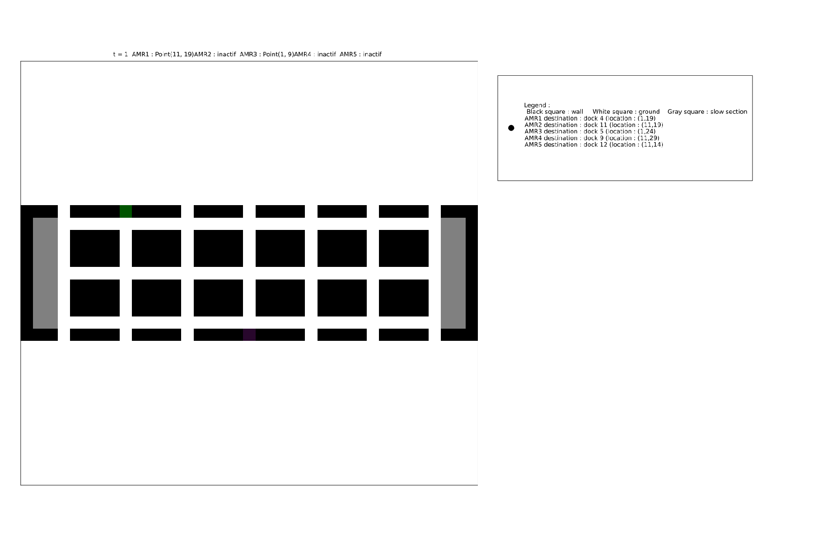

# Pathfinding project
This repository contains implementations of algorithms used in the pathfinding domain, and other algorithm for the multi-agent planification problem. This project is supervised by X. Gandibleux, Prof. Dr. Habil. in Computer Sciences at Nantes University.  

## Project structure
### [dat](./dat)
Contains several directories with .map file, and .dat files

#### .map files 
These files are used in the pathfinding part :
Includes real-world maps, such as Paris, London or other cities streets in [street_map](./dat/street_map), and maps from video games like [Warcraft III](./dat/dao-map/) or [Dragon Age: Origins](./dat/dao-map/).

#### .dat
Those files are used in  the MAPP part.
In the [AMR_data](./dat/AMR_data/) directory, you can find several files that represents different instances for the MAPP.
If you want to create your own, you will have to make three parts in your file. 
- One for the AMRs data : `AMR;start;goal;departureTime`. Make sure that start and goal correspond to existing Docks, and departureTime is an integer greater or equal than 0. You can add as much AMR you want, the more AMRs there are, the longer the computation will take.
- One for the Docks data : `DOCK;loc`, with loc two integers between parentheses, separate by a comma. Make sure that the localisation is represented by a dot '.' in the map. 
- One for the Trucks data : `TRUCKS;dock;arrivalTime;departureTime`. Make sure that dock correspond to existing dock. Use realistics data for arrivalTime and departureTime. If not, the AMR will have its path but no trucks would be able to pick up the delivery.
Those 3 parts should start by each description I gave you. Put one item by line.

The fourth part correspond to the map. You can make it as you wish. Just note that the points representing docks should be dots, and that all docks are reachable. If not, the program will stop with an error.

### [src](./src)
#### Pathfinding part
The different files used in the Pathfinding part start with `PF_`. 


The [PF_main.jl](./src/PF_main.jl) file contains the main function of the program. Once you run it, enter a file with a path (starting with ./dat/...), and two coordinates. It will save the results in [res](./res/), followed by the name of the instance.

##### Setup the code 
- `all = true` use all algorithm
- `all = false` choose on algorithm among all
- `printing = false` output results in the terminal
- `printing = true` output nothing


The [PF_algos.jl](./src/PF_algos.jl) file contains all pathfinding algorithms :  Dijsktra's, BFS, greedy-BFS, and A*.

#### Multi-Agent Planification Problem  -  AMR part
The different files used in the AMR part start with `AMR_`

The [AMR_main.jl](./src/AMR_main.jl) file contains the main function of the program. If you want to use an other data file, change the `filename` section on top of the file, without the path. The file has to be located in `./dat/AMR_data/`. For better displaying, make sure that you use the right number of AMRs, or more, on top of the [AMR_display.jl](./src/AMR_display.jl) file.  

##### Setup the code 
`display = true` output results in directory
`display = false` output nothing
`saveRes = true` save png file for each unit of time
`saveRes = false` don't save anything
`keepRes = true` output in both the terminal and the directory data of the computation
`keepRes = false` output nothing

### [doc](./doc)
Contains documents related to this project
- The slides used for my presentation
- *More incoming...*

### [res](./res/)
Contains folders with results of several computations.

Make your own with the following part !

## Run the code
### Pathfinding
- Download all the repository from GitHub
- In a terminal, move to the directory, and invoke `julia` at the root
- In the REPL, invoke `include("src/PF_main.jl")`

You have two ways of using the code :
1. Call the program directly in the Julia REPL. For example, you can define variables : fname *(a string which is a path to a .map file)*, S = start *(a 2-dimensional vector of Int64)*, G = goal *(a 2-dimensional vector of Int64)* in the REPL and use them like this : algoGreedy(fname, S, G) if you want to find a path from S to G in the map contained in fname with the Greedy-BFS algorithm.
2. Or you can run the main file and use the *run()* function. You will be guided to launch the execution. 

### Multi-agent planification problem
- Download all the repository from GitHub
- In a terminal, move to the directory, and invoke `julia` at the root
- In the REPL, invoke `include("src/AMR_main.jl")`
- Still in the REPL, invoke `main()`
  
The results will be located in `./res/filename` folder.

You can open the `.txt` file to see data, open `time1.png` file then scroll all the pictures, or open the `anim.gif` file and watch the execution

In this implementation, we suppose that several AMRs can be at one dock at the same time.

### Precisions for the inputs

The function may be called as follow : algo(fname, S, G) where algo is either algoDijkstra or algoGreedy or algoAstar or algoBFS. Its execution is made from the root of the project.


To ensure correct function execution, please use following inputs format: 
 - **fname** : a string which represents a path that leads to a .map file. 
 - **S** and **G**    : tuples of Int64, written like follow $(x,y)$ where $x,y \in Int64$   


The program will notify you if a point is unreachable or out of bounds.


## Results
### MAPP - AMR

| Instance          | number of (AMR,Truck,Docks)   | Size of the map       |
| :-----------      | :-----------:                 | :-----------:          |
| `hugeAMR.dat`     | (25,50,25)                    |  68 × 103
| `bigAMR.dat`      | (6,12,6)                      |  31 × 128             |         
| `normalAMR.dat`   | (5,14,5)                      |  11 × 37              | 
| `smallAMR.dat`    | (2,4,2)                       |  12 × 12              | 

#### Benchmark data 
Please note that only the computation time has been evaluated, graphic generation was disabled during benchmarking.

We note when all parameters are true, the larger the instance, the longer the graphics generation will take. 

Julia version : 1.12.5

##### `hugeAMR.dat` instance

BenchmarkTools.Trial: 24 samples with 1 evaluation per sample.
 
| Range (min … max): | 136.655 ms … 757.053 ms  | GC (min … max): |  0.00% … 81.74%   |
| :---               | :---                     | :---            | :---              | 
| Time  (median):    | 162.149 ms               | GC (median):    | 11.78%            |
| Time  (mean ± σ):  | 208.641 ms ± 159.825 ms  | GC (mean ± σ):  | 32.23% ± 21.18%   |

```
  ▃█▁▆                                                           
  ████▇▄▄▁▁▁▁▁▁▁▁▁▁▁▁▁▁▁▁▁▁▁▁▁▁▁▁▁▁▁▁▁▁▁▁▁▁▁▁▁▁▁▁▁▁▁▁▁▁▁▄▁▁▁▁▁▄ ▁
  137 ms           Histogram: frequency by time          757 ms <
```
 Memory estimate: 130.92 MiB, allocs estimate: 1653534.

###### `bigAMR.dat` instance
BenchmarkTools.Trial: 83 samples with 1 evaluation per sample.


| Range (min … max): | 39.660 ms … 445.383 ms  | GC (min … max): |  0.00% … 89.79%
| :----              | :----                   | :----           | :----
| Time  (median):    | 48.447 ms               | GC (median):    |  0.00%
| Time  (mean ± σ):  | 60.642 ms ±  57.332 ms  | GC (mean ± σ):  | 21.24% ± 16.08%


```
  ▅█▄▂                                                          
  ████▆▁▅▁▅▅▁▁▁▅▁▁▁▅▁▁▁▁▁▁▁▁▁▁▁▁▁▁▁▁▁▁▁▁▁▁▁▁▁▁▁▁▁▁▁▁▁▁▁▁▁▁▁▁▁▅ ▁
   39.7 ms       Histogram: log(frequency) by time       373 ms <
```

 Memory estimate: 41.54 MiB, allocs estimate: 787569.

 ###### `normalAMR.dat` instance

 BenchmarkTools.Trial: 5576 samples with 1 evaluation per sample.


 |Range (min … max): | 611.880 μs … 28.309 ms | GC (min … max): | 0.00% … 94.06% |
 | :---              | :----                  | :----           | :---- |
 |Time  (median):    | 706.850 μs             | GC (median):    | 0.00% |
 |Time  (mean ± σ):  | 886.010 μs ±  1.202 ms | GC (mean ± σ):  |17.38% ± 12.38% |  

  
```
  █▆▃                                                          ▁  
  ████▆██▆▄▅▃▄▅▁▁▁▄▁▁▁▁▁▁▁▁▁▁▁▁▁▁▁▁▁▁▁▁▁▁▁▁▁▁▁▁▁▁▁▁▁▁▁▁▆▅▆▆▆▅▆ █  

  612 μs        Histogram: log(frequency) by time      7.71 ms <  
```
  

 Memory estimate: 1.45 MiB, allocs estimate: 32260.  

  

 ###### `smallAMR.dat` instance  

  

 BenchmarkTools.Trial: 10000 samples with 1 evaluation per sample.  


| Range (min … max):|251.727 μs …  19.636 ms|GC (min … max):|0.00% … 95.20%| 
| :--- | :--- | :--- | :--- |  
| Time  (median):|297.160 μs                |GC (median):|0.00%  |
| Time  (mean ± σ):|355.556 μs ± 609.273 μs|GC (mean ± σ):|14.64% ±  8.65%|

```
      ▂██▆▃▃▄▅▃                                                  
  ▃▄▅▆██████████▆▄▄▃▃▃▃▃▃▂▂▂▂▂▂▂▂▂▂▂▂▂▂▁▂▂▂▂▁▁▂▂▂▁▂▂▂▂▂▂▂▂▁▂▁▂▂ ▃

  252 μs           Histogram: frequency by time          571 μs <  
```
  

 Memory estimate: 563.12 KiB, allocs estimate: 7128. 

 #### Example

 Here is an example of the results with the `normalAMR.dat` instance :

  

